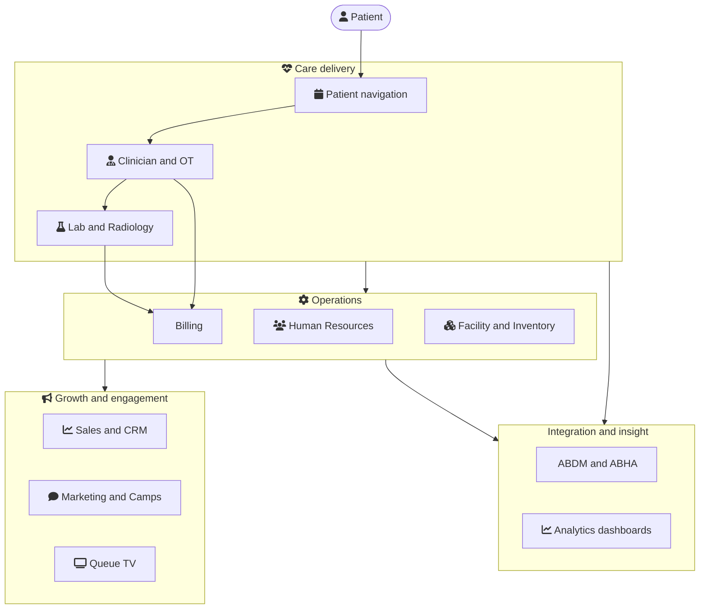

# Welcome to the MetahOS Guide

This is your complete, hands-on manual for **MetahOS — the Healthcare Operating System**. Whether you run the front desk, a lab, the pharmacy, an operating theatre, or the whole hospital, you'll find step-by-step workflows, configuration references, and a visual **"Workflow at a glance"** diagram on almost every page.

:::tip New here? Take it in three steps
1. Read **[What is MetahOS](#what-is-metahos)** to understand what the platform does.
2. Skim **[The platform at a glance](#the-platform-at-a-glance)** to see how the modules fit together.
3. Pick your area from the sidebar — each module opens with a diagram, then detailed how-to pages. Hover any diagram node for a quick explanation.
:::

## What is MetahOS

MetahOS is a Healthcare Operating System that runs across the **continuum of care** — from a patient's first enquiry, through consultation, diagnostics, admission and billing, all the way to follow-up and engagement. It brings every department onto one platform so your teams can focus on treating patients, not wrestling with technology.

Check out our health stack:

### For hospitals

A single platform for OPD, IPD, OT, diagnostics, pharmacy, HR, inventory, billing and more:

### Build your own EMR

As a practising doctor you can build your own EMR on MetahOS — arrange the consultation screen, macros and care plans around how *you* work. The clinician section walks you through it.

### Built-in Data Lake

MetahOS ships with a full Data Lake so you can integrate every existing system in your institution and augment it with new capabilities — no rip-and-replace required.

## The platform at a glance

Here's how the major modules connect — the patient moves through care delivery, which feeds operations, growth and integration:

## How this guide is organized

This guide is **versioned to match the product** — you're reading **v1.0.70**. Every module section opens with a *Workflow at a glance* diagram, followed by task-focused pages with the exact buttons, fields, permissions and configuration keys.

The sidebar is grouped by how a healthcare team actually works:

- **Patient journey** — Patient Navigation, Pre-Doctor / Secretary, Clinician, IP, OT, MRD, Referral
- **Diagnostics** — Laboratory & Diagnostics, Radiology
- **Operations** — Human Resources, Facility & Inventory, Billing & Payments, ESI & CGHS
- **Growth & engagement** — Sales & CRM, Marketing, Queue TV, Notifications, Camps
- **Integration & insight** — ABDM / ABHA, Analytics & AI Dashboards
- **Build & extend** — Form Builder, Authentication, Security, Workflow Engine, Integration with MetahOS

:::note How to read the diagrams
Each *Workflow at a glance* diagram uses icons to show the steps and decisions in a flow. **Hover over any node** for a one-line explanation, and toggle the moon/sun in the top bar to switch between light and dark.
:::

## What's new in v1.0.70

Since the previous guide (v1.0.39), MetahOS added a lot. Highlights you'll find documented here:

- **Laboratory** — home-collection booking with a full rider workflow, barcode/accession tracking, the TinyMCE macro editor, computed parameters and color-coded interpretation.
- **Radiology** — a new imaging-native module with appointments and a reporting lifecycle.
- **Sales & CRM** — a sales pipeline with quotations, orders, invoices, payments, and a refined leads worklist.
- **Human Resources** — an attendance module with geofenced punches, merged leave requests & approvals, and richer user records.
- **ABDM / ABHA** — ABHA creation, auto-linking, consent & data sharing, PHR, and scan-and-share.
- **Analytics** — AI dashboards including Patient Acquisition and Brand Sentiment & NPS.
- **Operations** — ESI monthly lab annexure, CGHS tools, bank/CIB payments, inventory barcodes and package management, and more.

## Start today

Questions or onboarding? Reach us at **contact@m16labs.com** or visit [metahos.com](https://metahos.com).

Prefer video courses? Everything here is also available at [learn.metahos.com](https://learn.metahos.com).
