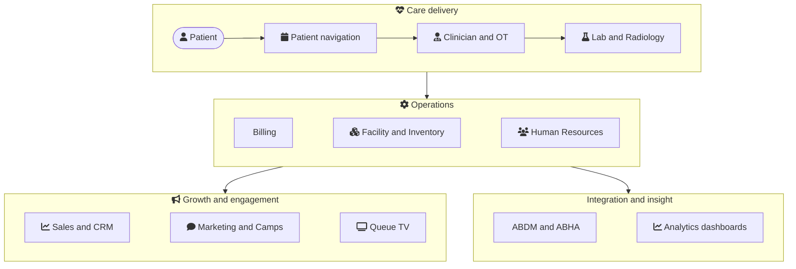

# Welcome to the MetahOS Guide

This is your complete, hands-on manual for **MetahOS — the Healthcare Operating System**. Whether you run the front desk, a lab, the pharmacy, an operating theatre, or the whole hospital, you'll find step-by-step workflows and a visual **"Workflow at a glance"** diagram on almost every page.

:::tip New here? Take it in three steps
1. Read **[What is MetahOS](#what-is-metahos)** to understand what the platform does.
2. Skim **[The platform at a glance](#the-platform-at-a-glance)** to see how the modules fit together.
3. Pick your area from the sidebar — each module opens with a diagram, then detailed how-to pages. Hover any diagram node for a quick explanation.
:::

## What is MetahOS

MetahOS is a Healthcare Operating System that runs across the **continuum of care** — from a patient's first enquiry, through consultation, diagnostics, admission and billing, all the way to follow-up and engagement. It brings every department onto one platform so your teams can focus on treating patients, not wrestling with technology.

Check out our health stack:

### For hospitals

A single platform for OPD, IPD, OT, diagnostics, pharmacy, HR, inventory, billing and more:

### Build your own EMR

As a practising doctor you can build your own EMR on MetahOS — arrange the consultation screen, macros and care plans around how *you* work. The clinician section walks you through it.

### Built-in Data Lake

MetahOS ships with a full Data Lake so you can integrate every existing system in your institution and augment it with new capabilities — no rip-and-replace required.

## The platform at a glance

Here's how the major modules connect — the patient moves through care delivery, which feeds operations, growth and integration:

## How this guide is organized

This guide is **versioned to match the product** — you're reading **v1.0.77**. Every module section opens with a *Workflow at a glance* diagram, followed by task-focused pages with the exact buttons, fields and permissions.

The sidebar is grouped by how a healthcare team actually works:

- **Patient journey** — Patient Navigation, Pre-Doctor / Secretary, Clinician, IP, OT, MRD, Referral
- **Diagnostics** — Laboratory & Diagnostics, Radiology
- **Operations** — Human Resources, Facility & Inventory, Billing & Payments
- **Growth & engagement** — Sales & CRM, Marketing, Queue TV, Notifications, Camps
- **Integration & insight** — ABDM / ABHA, Analytics & AI Dashboards
- **Build & extend** — Form Builder, Authentication, Security, Workflow Engine, Integration with MetahOS

:::note How to read the diagrams
Each *Workflow at a glance* diagram uses icons to show the steps and decisions in a flow. **Hover over any node** for a one-line explanation, and toggle the moon/sun in the top bar to switch between light and dark.
:::

## What's new in v1.0.77

Since v1.0.70, the biggest changes are in the laboratory, the sales module and access control:

- **Laboratory** — per-status pending worklists with their own permissions, a rejected-sample status, single-stage accession and a barcode **Lab Scanner**, outsourced tests merged into the ordinary report modal (and reportable in-house), lab orders raised during a consultation and billed onto the consultation bill, Prev/Next navigation through a worklist, audit history on results, and bulk report export as a ZIP.
- **Sales & CRM** — Phase 3 adds proforma invoices with approvals and advances, delivery challans and notes, returns and credit notes, price lists, discount approval, credit limits and a reports tab.
- **Security & access control** — bucket authorities for assigning sites as a bundle, and system-generated doctor user IDs that doctors can sign in with.
- **Patient records** — structured allergies with severity and status history, next-of-kin details, identity-document expiry tracking, and a full patient edit history.
- **Clinician** — age- and gender-aware vitals reference ranges, and consultations that can be booked without a named doctor.
- **Facility & Inventory** — batch expiry carried through to the GRN and exports, corrected PAR and critical-PAR filters, and High-Risk / LASA medicine badges.
- **Workflow** — a review-any capability on doctor consolidated bills, for teams that check bills without approving them.
- **Queue TV** — an "Our Doctors" board on idle screens, and a monitor showing which screens are online.

## Start today

Questions or onboarding? Reach us at **contact@m16labs.com** or visit [metahos.com](https://metahos.com).

Prefer video courses? Everything here is also available at [learn.metahos.com](https://learn.metahos.com).
